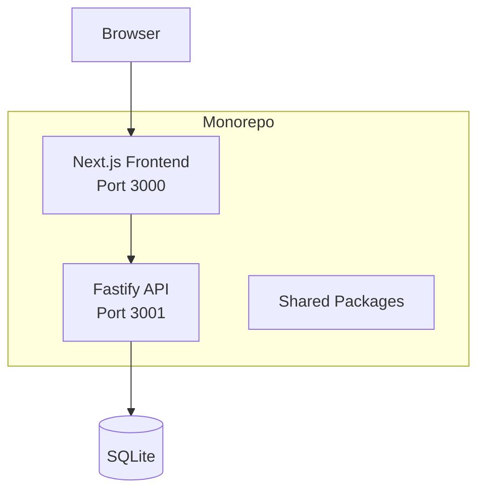
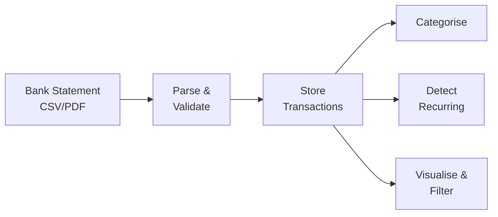

# Architecture Overview

## System Diagram



## Project Structure

```
personal-finance/
├── apps/
│   ├── api/          # Fastify backend
│   └── web/          # Next.js frontend
├── packages/
│   ├── eslint-config/ # Shared ESLint configs
│   └── tsconfig/      # Shared TypeScript configs
└── docs/
    ├── adr/           # Architecture decision records
    └── design/        # Feature design docs
```

## Tech Stack

| Layer    | Technology        |
| -------- | ----------------- |
| Frontend | Next.js, React 19 |
| Styling  | Tailwind CSS      |
| Backend  | Fastify           |
| ORM      | Drizzle           |
| Database | SQLite            |
| Testing  | Vitest            |
| Monorepo | Turborepo, pnpm   |
| Language | TypeScript        |

## Data Flow


