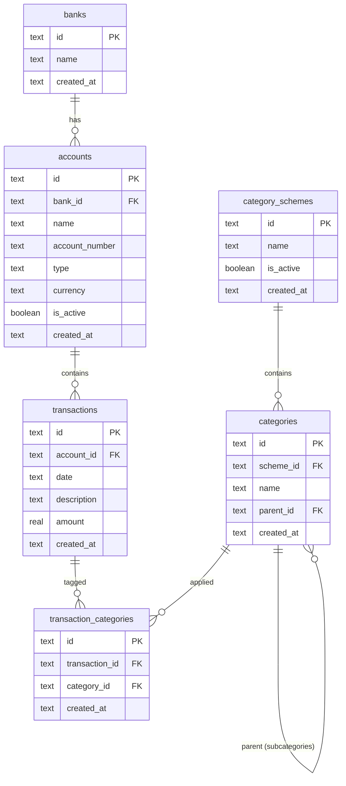

# Feature: Data Model

## Problem

We need a schema to store bank transactions across multiple banks and accounts, with flexible categorisation that supports switching between different category schemes.

## Data Model

## Key Decisions

- **Signed amounts**: positive = credit (money in), negative = debit (money out)
- **Category schemes**: categories belong to a scheme, allowing multiple categorisation sets (e.g., "Simple" vs "Tax")
- **Subcategories**: self-referencing `parent_id` on categories (e.g., "Food & Drink" → "Groceries")
- **Transaction ↔ Category join table**: a transaction can have a category per scheme, enabling switching between schemes without losing data
- **Account types**: "checking", "savings", "credit" — covers daily banking and credit cards
- **SQLite**: file-based, zero config. Can migrate to PostgreSQL later via Drizzle
